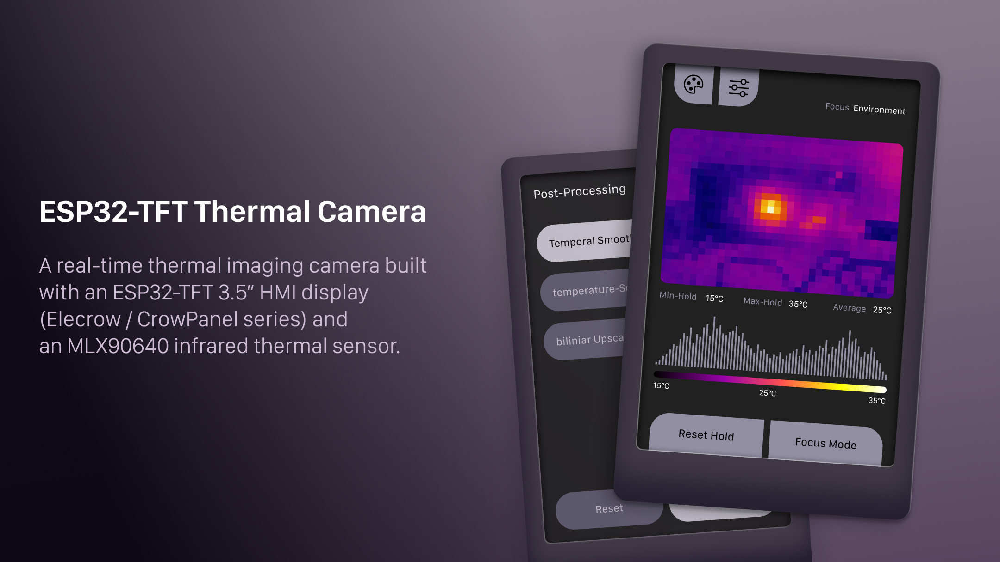
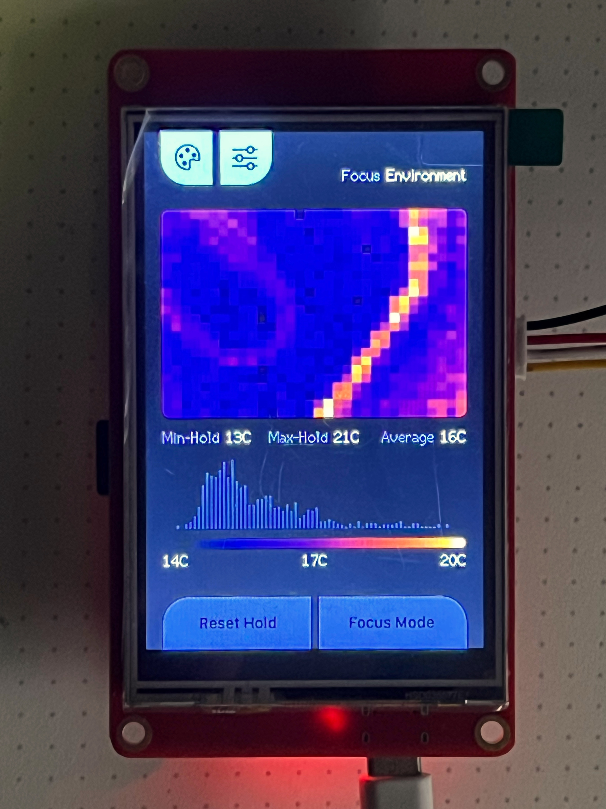
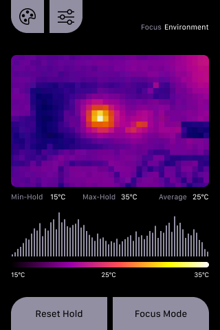
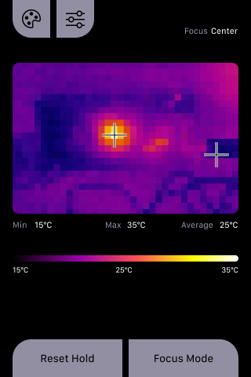
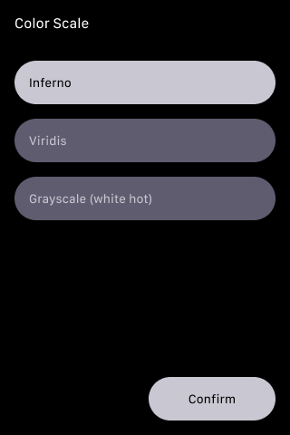
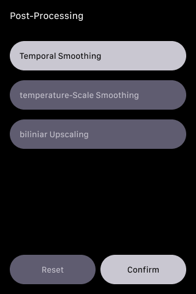

# ESP32-TFT Thermal Camera

A real-time thermal imaging camera built with an **ESP32-TFT 3.5” HMI display (Elecrow / CrowPanel series)** and an **MLX90640 infrared thermal sensor**.  
This project focuses on **efficient rendering**, **clear thermal analysis**, and **professional-grade UI concepts**, while running entirely on an ESP32.

---

## Overview

This project implements a fully standalone thermal camera with:

- Live thermal image rendering (up to 16 Hz)
- Multiple focus and analysis modes
- Perceptually uniform color scales
- Touch-based UI
- Optimized partial redraws for SPI TFT displays

The codebase is designed to be:
- Understandable months later
- Approachable for newcomers
- Structured around clear data and rendering pipelines



---

## Hardware Setup

### MCU & Display

**ESP32-TFT 3.5” HMI Display Module**  
*(Elecrow / CrowPanel Series)*

- MCU: ESP32 (dual core)
- Display size: 3.5”
- Resolution: 320 × 480 pixels
- Interface: SPI
- Touch: Resistive (handled by TFT_eSPI)
- Library: TFT_eSPI

#### Important Display Characteristics

- No full framebuffer available
- All drawing happens directly in display RAM
- Full-screen redraws at high frame rates are not feasible
- Partial redraws are fast and reliable

➡️ This strongly influences the UI and rendering architecture of the project.

---

### Thermal Sensor

**MLX90640 Infrared Thermal Camera**

- Resolution: 32 × 24 pixels
- Interface: I²C
- I²C Address: 0x33
- Operating mode: CHESS
- ADC resolution: 18-bit
- Refresh rate: 16 Hz

#### Physical Limitations

- Low spatial resolution
- Increased noise on edge pixels
- Not suitable for long-distance object recognition (e.g. buildings at 20 m)

---

## Arduino IDE Setup

This project requires Arduino IDE 1.8.x or later with ESP32 support.

### 1. Install ESP32 Board Support

- Open Arduino IDE
- Go to **File > Preferences**
- In the "Additional Boards Manager URLs" field, add:  
  `https://dl.espressif.com/dl/package_esp32_index.json`
- Click **OK**

- Go to **Tools > Board > Boards Manager**
- Search for "esp32" and install "esp32 by Espressif Systems"

### 2. Select Board and Settings

- Go to **Tools > Board** and select **ESP32 Dev Module** (or your specific ESP32 board)
- Set the following options:
  - **Upload Speed**: 115200
  - **CPU Frequency**: 240 MHz (WiFi/BT)
  - **Flash Frequency**: 80 MHz
  - **Flash Mode**: QIO
  - **Flash Size**: 4 MB (32 Mb)
  - **Partition Scheme**: Huge APP (3 MB No OTA / 1 MB SPIFFS)
  - **Core Debug Level**: None
  - **PSRAM**: Enabled

### 3. Install Required Libraries

Install the following libraries via **Sketch > Include Library > Manage Libraries**:

- **TFT_eSPI** by Bodmer (version 2.5.0 or later)
- **Adafruit_MLX90640** by Adafruit (version 1.1.2 or later)

### 4. Configure TFT_eSPI

- After installing TFT_eSPI, navigate to your Arduino libraries folder
- Open `TFT_eSPI/User_Setups/`
- Copy or modify a setup file for your display (e.g., for ILI9488 or similar SPI displays)
- Ensure the pins match your hardware (default SPI pins are used in this project)

### 5. Upload the Sketch

- Connect your ESP32 board via USB
- Select the correct COM port in **Tools > Port**
- Open `esp32-tft-thermal-camera.ino` in Arduino IDE
- Click **Upload**

---

## Software Architecture

### High-Level Pipeline

```
MLX90640 Frame
   ↓
Optional Filtering
   ↓
Analysis (per Focus Mode)
   ↓
Rendering (incremental)
```

---

## Focus Modes

### 1. Environment Mode

- Analysis over the entire sensor ROI
- Displays:
  - Min temperature (hold)
  - Max temperature (hold)
  - Average temperature (live)
- Histogram enabled
- Auto-ranging based on environment



---

### 2. Center Mode

- Analysis restricted to the center focus rectangle
- Displays:
  - Min / Max / Average inside focus box
- Histogram disabled
- Useful for spot measurements


---

### 3. Hot / Cold Mode

- Automatically finds:
  - Hottest pixel
  - Coldest pixel
- Displays double-line crosshairs (white + black) for visibility
- Temperature bar shows:
  - Coldest (live)
  - Hottest (live)
  - Average (environment)
- Histogram disabled



---

## Color Scales

### Inferno (Default)

- Perceptually uniform
- High contrast in dark and mid ranges
- Ideal for:
  - Thermal leaks
  - Cold bridges
  - Technical analysis

### Viridis

- Perceptually uniform
- Very smooth luminance transition
- Suitable for quantitative interpretation

### White Hot

- Classic grayscale
- Intuitive and familiar
- Useful as a reference mode



## Rendering Strategy

To achieve smooth performance on an SPI TFT:

| UI Element        | Update Strategy |
|------------------|-----------------|
| Thermal Image    | Every frame     |
| Focus Overlay    | As needed       |
| Temperature Bar  | Throttled       |
| Histogram        | Throttled       |
| Color Gradient   | On change only  |

Key techniques:
- Cached histogram heights
- Gradient redraw only when range or color mode changes
- Aggressive clearing of affected UI regions when switching modes

---

## Noise & Artifact Handling

- Edge pixels excluded from all calculations
- Black lines drawn below the thermal image to suppress stray pixels
- Rounded corner masking applied after image draw
- Histogram and gradient caches reset on mode changes

---

## Controls

### Touch Buttons

- Top left: Color scale menu
- Top right: Post-processing menu
- Bottom left: Reset Min/Max Hold
- Bottom right: Cycle focus modes



## Libraries Used

- TFT_eSPI
- Adafruit_MLX90640
- Wire (I²C)
- SPI

---

## Project Goals

- Demonstrate professional thermal UI concepts on low-cost hardware
- Provide a clean and well-documented reference implementation
- Make design trade-offs explicit and understandable
- Serve as a foundation for future extensions

---

## Possible Extensions

- SD card snapshot logging
- CSV export of thermal frames
- USB / WiFi streaming
- Emissivity correction
- Temperature alarms

---

## License

This project is licensed under the MIT License - see the [LICENSE](LICENSE) file for details.

### Dependencies

This project uses the following libraries, each with their own licenses:

- [TFT_eSPI](https://github.com/Bodmer/TFT_eSPI) - MIT License
- [Adafruit_MLX90640](https://github.com/adafruit/Adafruit_MLX90640) - Apache 2.0 License

The Arduino framework is used but not included in this repository.

This project is intended for educational and experimental use.
